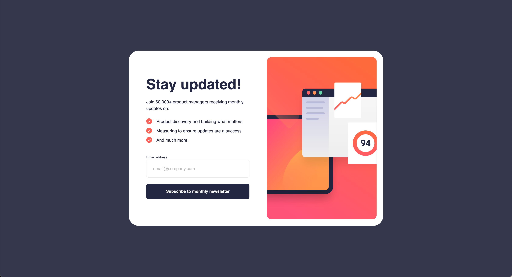

# Frontend Mentor - Newsletter sign-up form with success message solution

This is a solution to the [Newsletter sign-up form with success message challenge on Frontend Mentor](https://www.frontendmentor.io/challenges/newsletter-signup-form-with-success-message-3FC1AZbNrv). Frontend Mentor challenges help you improve your coding skills by building realistic projects.

## Table of contents

- [The challenge](#the-challenge)
- [Screenshot](#screenshot)
- [links](#links)
- [Built with](#built-with)
- [Author](#author)

### The challenge

Users should be able to:

- Add their email and submit the form
- See a success message with their email after successfully submitting the form
- See form validation messages if:
  - The field is left empty
  - The email address is not formatted correctly
- View the optimal layout for the interface depending on their device's screen size
- See hover and focus states for all interactive elements on the page

### Screenshot

### Links

- Live Site URL: [Add live site URL here](https://your-live-site-url.com)

### Built with

- HTML5
- CSS
- BEM
- Flexbox
- CSS Grid
- Mobile-first workflow
- SASS, SCSS

## Author

- LinkedIn - [Stanislav Cortac](https://www.linkedin.com/in/stanislav-cortac-a32707207/)
- Frontend Mentor - [@1ceB0T](https://www.frontendmentor.io/profile/1ceB0T)
- Instagram - [@corrtac](https://www.instagram.com/corrtac/)
